# Create A Serverless .NET Core API Like A Senior Developer
There are already many, many tutorials out there that talk about getting baby's first API endpoint up and running with AWS Lambda and AWS API Gateway. I want to take that all a step further, and have it be easy to follow and understand.

We are just going to create a simple API with a GET method that simply retrieves information about video courses from a database table. 

Having said that, we are going to use some techniques that go beyond the scope of most simple API tutorials. We are going to go over ideas such as infrastructure as code, automated testing, CI/CD, runtime dependency injection, error alerting, and more.

## Preface
This tutorial is written in great detail, perhaps more detail than a more experienced developer will need. In the areas where I reference basic fundamental ideas, I have either placed links to other areas where those fundamental ideas are explained or I have placed links to skip ahead to the more advanced ideas. 

If you are at a section for which you already understand the material, there will be an opportunity for you to skip ahead. 

## Prerequisites
To get started, you will need the following:
* an AWS account
* a Github account
* a TravisCI account set up with your Github account
* Visual Studio 2019
* Visual Studio Code (not strictly required but nice for navigation and visualization imo)
* AWS SAM CLI
* AWS CLI
* AWS SDK for .NET

## Creating the .NET project
Open Visual Studio 2019. Click "Create a New Project". In the search bar at the top, start typing "AWS Serverless".

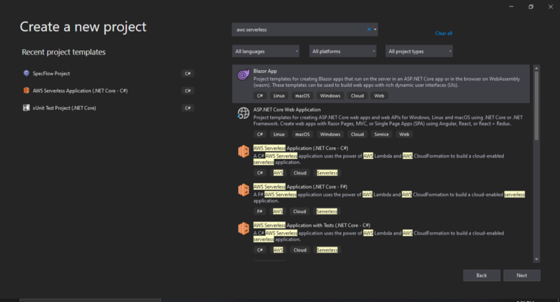

Select the one that says "AWS Serverless Application (.NET Core - C#)". Don't select the one that says "AWS Serverless Application with Tests (.NET Core - C#)", we will be adding our own testing libraries later.

Click "Next". Choose a name for your project and choose the location in which you want to save the project.

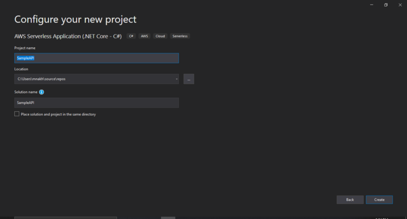

Click "Create". Now another window will pop up with a bunch of options on what kind of AWS serverless project you want to create.


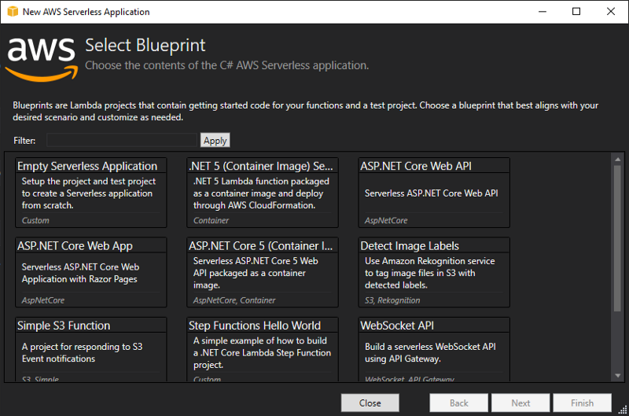

Select the one in the top left that says "ASP.NET Core Web API" and click "Finish".
 
Hooray, you have an API!

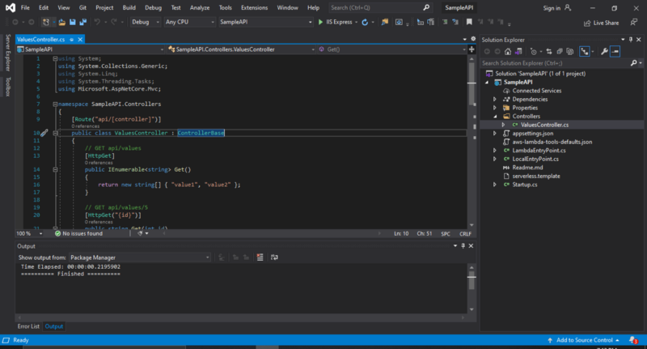

## Generated project files and their purposes
Feel free to [skip to the next section](#project-setup-to-begin-developing) if you just want to dive straight into the building.

Let's go over each of the most important files created for us and what they do. Below is a tree diagram of the project setup.

```bash
│   SampleAPI.sln
│
└───SampleAPI
    │   appsettings.Development.json
    │   appsettings.json
    │   aws-lambda-tools-defaults.json
    │   LambdaEntryPoint.cs
    │   LocalEntryPoint.cs
    │   Readme.md
    │   SampleAPI.csproj
    │   SampleAPI.csproj.user
    │   serverless.template
    │   Startup.cs
    │
    ├───bin
    │   └───Debug
    │       └───netcoreapp3.1
    ├───Controllers
    │       ValuesController.cs
    │
    ├───obj
    │   │   project.assets.json
    │   │   project.nuget.cache
    │   │   SampleAPI.csproj.nuget.dgspec.json
    │   │   SampleAPI.csproj.nuget.g.props
    │   │   SampleAPI.csproj.nuget.g.targets
    │   │
    │   └───Debug
    │       └───netcoreapp3.1
    │               .NETCoreApp,Version=v3.1.AssemblyAttributes.cs
    │               SampleAPI.AssemblyInfo.cs
    │               SampleAPI.AssemblyInfoInputs.cache
    │               SampleAPI.assets.cache
    │               SampleAPI.csprojAssemblyReference.cache
    │
    └───Properties
            launchSettings.json
```

**SampleAPI.sln**

A .NET application is composed of a solution file and one or more projects. This is the main file that describes data needed to load the application project(s) and configure the computer architecture setup on which it runs. More detail can be found [here](https://docs.microsoft.com/en-us/visualstudio/extensibility/internals/solution-dot-sln-file?view=vs-2019).


**appsettings.json and appsettings.[Environment].json**

This provides variable value assignment for each environment in which your application runs. ```appsettings.json``` applies to all environments unless overridden and ```appsettings.[Environment].json``` is for specific environments.

**aws-lambda-tools-defaults.json**

This file describes default settings for your AWS account with respect to your application, such as region, runtime environment (labeled as "framework"), any serverless templates describing the application's configuration (more on this later), and more.

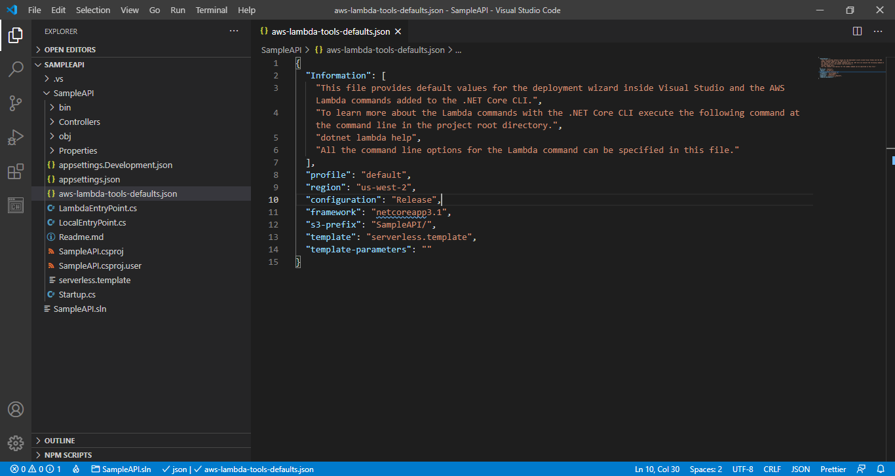

**LambdaEntryPoint.cs**

The code in this file is what is executed when a project actually runs inside of AWS Lambda.  A web host builder object is executing a startup method to set up the configuration of the running application. The ```UseStartup``` method on line 38 allows for the execution of Startup.cs, which includes object-level configuration for your application. We will explain more shortly.


**LocalEntryPoint.cs**

The code in this file is what is executed when a project is running on your local machine as you are testing development. Like with any C# program, there is a Main method and inside of that, there is a method that will execute your object-level configuration from ```Startup.cs```.

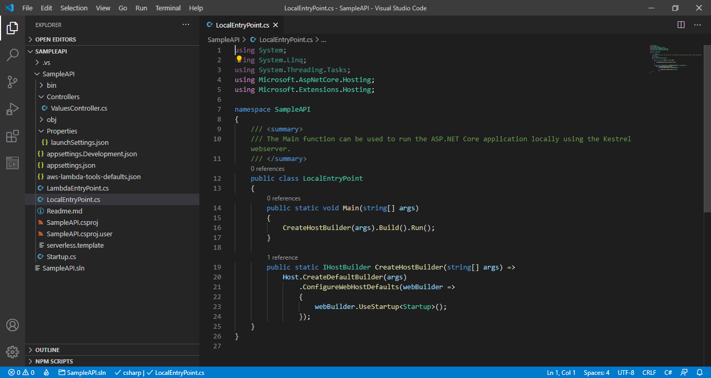

**SampleAPI.csproj**

This file defines your C#-specific configuration settings for your project, including its runtime environment, its compilation settings, and a list of all external packages and versions for the project.

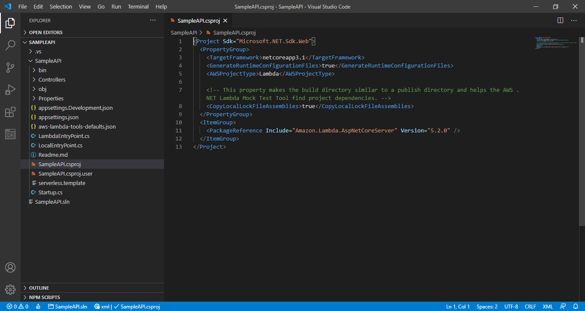

**serverless.template**

This file contains definitions for cloud resources and permissions needed for the lambda function to run in AWS. This file is an example of [infrastructure as code](https://en.wikipedia.org/wiki/Infrastructure_as_code), which allows us to define everything we need outside of our code to make it a usable software application. We will rework this file later.

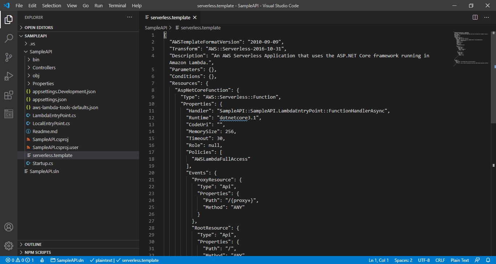

**Startup.cs**

This file creates specific objects required for your application to run. It allows for application level object configuration like allowing the project to use HTTPS redirection, authorization, and specific implementations of object interfaces required for your app.

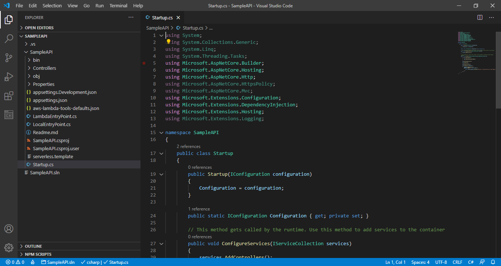

**ValuesController.cs**

This file defines a set of HTTP endpoints within our API and what actions are taken when the specific URLs and HTTP methods are hit.

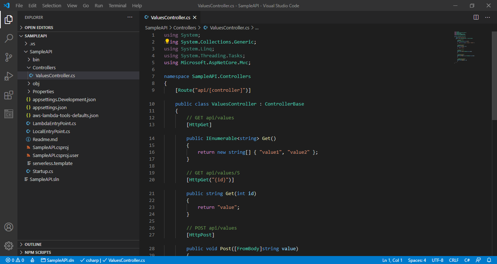

<a id="project-setup-to-begin-developing"></a>

## Installing necessary NuGet packages

<a id="nuget-packages-reference"></a>

Okay, let's get crackalackin'. The first thing we will need will be to import some [NuGet packages](#nuget-packages) to begin writing the code.

Right click on the ```SampleAPI``` project name and select ```Manage NuGet Packages```.

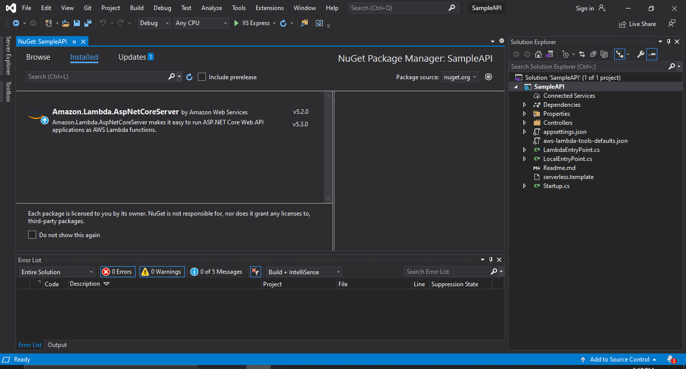

Actually, hold on, before we install more NuGet packages, let's upgrade the one that exists in here now.  Click on the package. Notice that next to the description inside the main window, we have ```v5.2.0``` but underneath it, it says ```v5.3.0```. We're going to want to select the latest stable version of this package.  


Select the dropdown menu I have circled in <span class="blue" style="color:blue;">blue</span>, scroll to the top of the menu and select ```Latest stable 5.3.0``` and click the Update button.  In just a little bit, you should see a window called Preview Changes pop up, which will highlight the old and new versions of the package and its dependencies. Click OK.

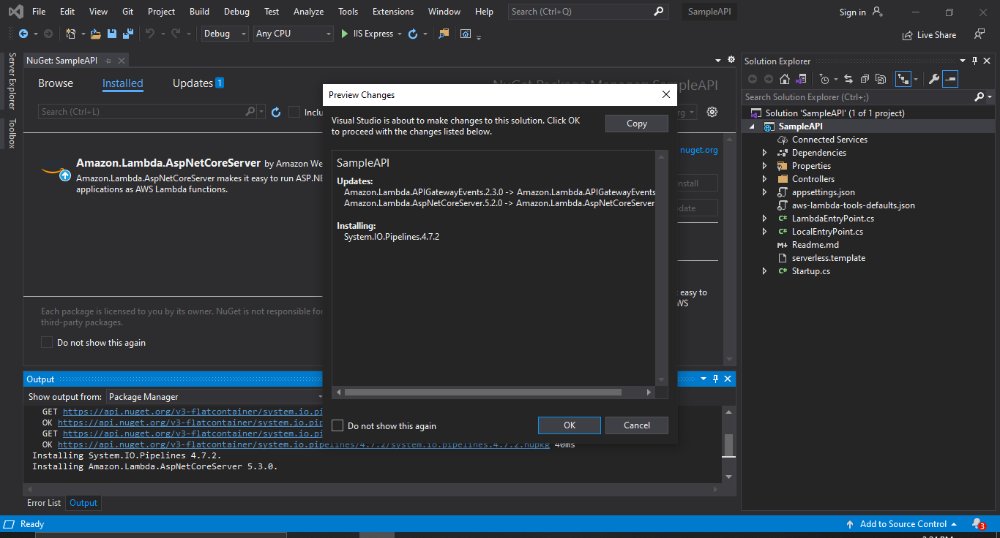

Now the information about your installed package should look as below. Notice that to the right of the description, there is only ```v5.3.0```.


<a id="serialization-reference"></a>
<a id="deserialization-reference"></a>

Ooookay, now that we have upgraded the existing Amazon AspNetCoreServer, we can begin adding the other packages we will need. Go to the Browse tab next to Installed. 


Hey, what do you know, the first package we need is right in front of our face, [Newtonsoft.Json](https://www.newtonsoft.com/json).  This library will help us with object [serialization](#serialization) and [deserialization](#deserialization).

At this point, you can click the Install button, and then click OK when the Preview Changes window comes up.

Now, in the search bar underneath the ```Browse``` tab, you will want to search for the following packages

* AWSSDK.Core
* AWSSDK.DynamoDBv2
* AWSSDK.Extensions.NETCore.Setup

## Defining the project domain

### Creating the Course object

<a id="domain-driven-design-reference"></a>

A popular paradigm for building software projects is [domain-driven design](#domain-driven-design), so we're going to create a Domain folder in our project. One of the central items will be the Course object. Create a new file Course.cs in the Domain folder. <!-- TODO: describe how to create a new file with screenshots -->

In our case, our Course will have a name, an instructor, a description, a category, and a list of associated videos. Start writing the following:

```csharp
[JsonProperty("name")]
public String Name { get; set; }
```

C# naming convention dictates that properties and methods of objects should be written as CamelCase. However, the JSON property we will want to return is ```name``` with a lower case N. However, you will now receive an error on ```JsonProperty```. To remedy this, hover over the red error line, and then select "Show potential fixes".

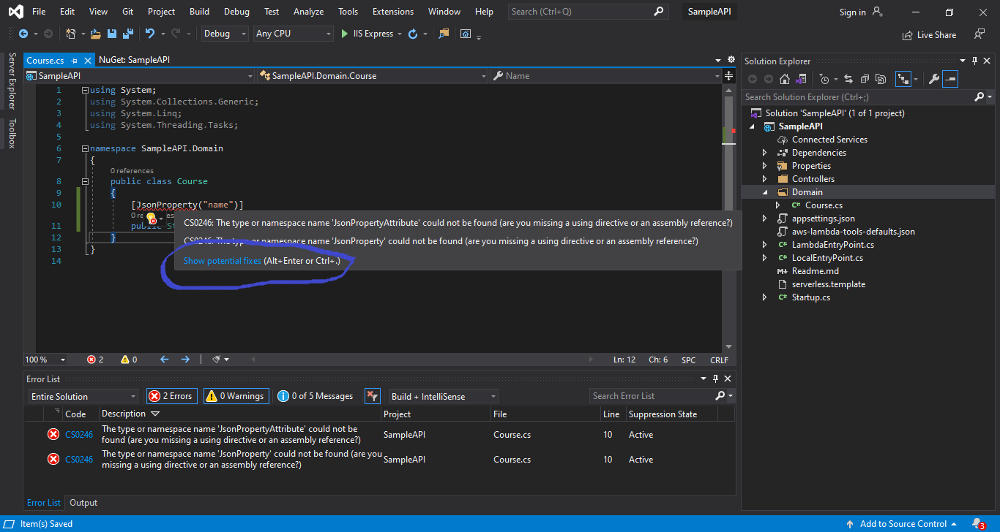

The exact fix we need is already in here! Click on "using Newtonsoft.Json;", and then that will import the library at the top of the file.  Your complete file now should look like this so far.

```csharp
using Newtonsoft.Json;
using System;
using System.Collections.Generic;
using System.Linq;
using System.Threading.Tasks;

namespace SampleAPI.Domain
{
    public class Course
    {
        [JsonProperty("name")]
        public String Name { get; set; }
    }
}
```

Inside of Visual Studio, you will see some grayed out ```using``` statements at the top of the file. This means your file is *not* using those statements. Feel free to just delete those lines.

Now we are going to want to add the following properties to the file.

```csharp
[JsonProperty("instructor")]
public string Instructor { get; set; }

[JsonProperty("category")]
public string Category { get; set; }

[JsonProperty("description")]
public string Description { get; set; }

[JsonProperty("videos")]
public List<Video> Videos { get; set; }
```

Now you will get another error. It will say something like **"The type or namespace name 'Video' could not be found (are you missing a using directive or an assembly reference?)"**. That's okay, because we're going to create that right here.

### Creating the Video object

Just like we did for ```Course.cs```, we are going to right click on the Domain folder and add a new item


# Glossary
<a id="deserialization"></a>
**Deserialization:** The act of converting a C# object to a sequence of bytes, but in the case of this project, the C# object is converted to a JSON object. [Back to reference](#deserialization-reference)

<a id="domain-driven-design"></a>
**Domain-driven design:** A software development paradigm where the heaviest focus is on the customer-oriented objects with which the app needs to interact. Read more on this [blog post](https://airbrake.io/blog/software-design/domain-driven-design). [Back to reference](#domain-driven-design-reference)

<a id="nuget-packages"></a>
**NuGet package:** A downloadable code library that contains compiled code to be used in a C# project. [Back to reference](#nuget-packages-reference)

<a id="serialization"></a>
**Serialization:** The act of converting a sequence of bytes to a C# object, but in the case of this project, it is a JSON object that is converted to the C# object. [Back to reference](#serialization-reference)