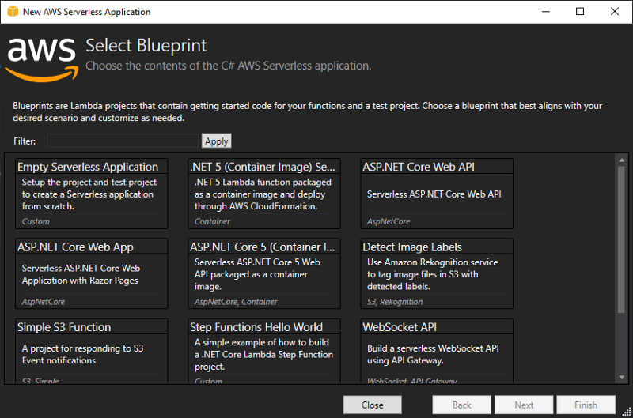
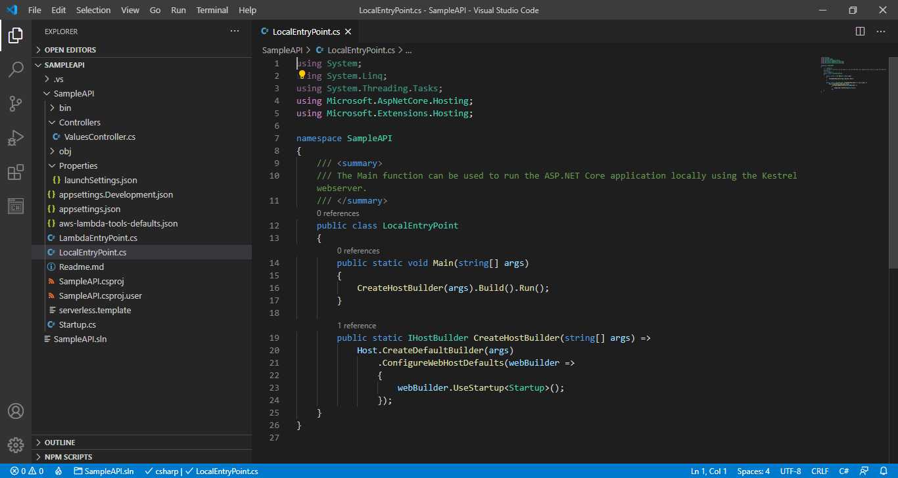
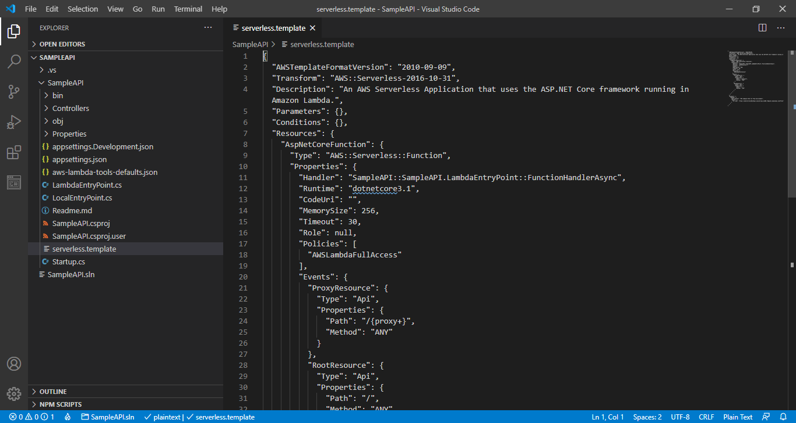
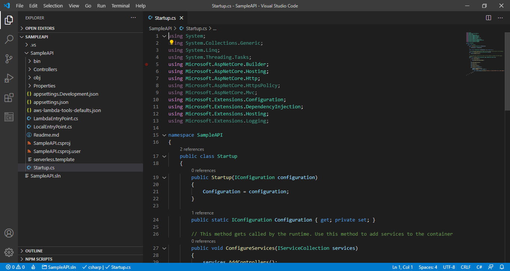
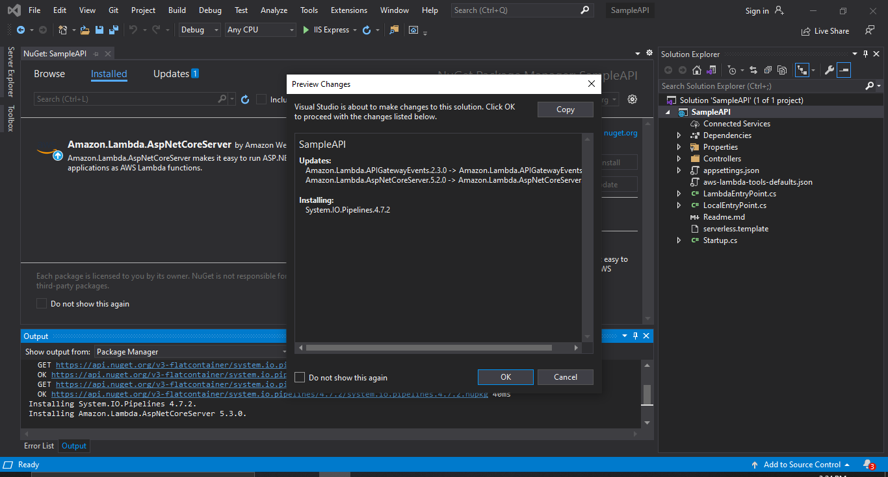
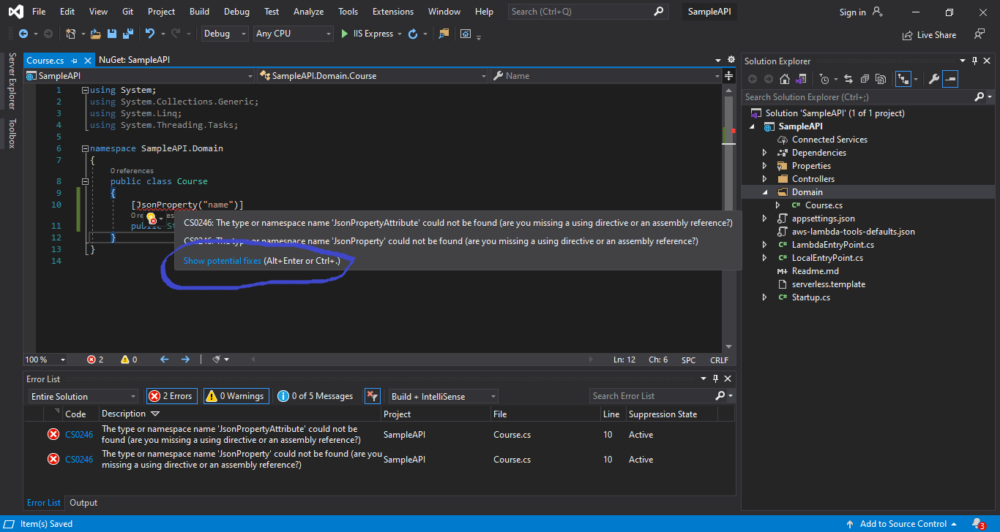

# **Build a serverless API like a senior developer**
## **Table of contents** <!-- omit in toc -->
 - [**Preface**](#preface)
  - [**Prerequisites**](#prerequisites)
  - [**Creating the .NET project**](#creating-thenetproject)
  - [**Generated project files and their purposes**](#generated-project-files-and-their-purposes)
  - [**Installing necessary NuGet packages**](#installing-necessary-nuget-packages)
  - [**Defining the project domain**](#defining-the-project-domain)
    - [**Creating the Course object**](#creating-the-course-object)
    - [**Creating the Video object**](#creating-the-video-object)
    - [**Design considerations**](#design-considerations)
  - [**Automated unit testing**](#automated-unit-testing)
  - [**Creating the query layer**](#creating-the-query-layer)
  - [**Implementing the CourseModel view model**](#implementing-the-coursemodel-view-model)
  - [**Back to query**](#back-to-query)
  - [**Executing the unit test**](#executing-the-unit-test)
  - [**Creating the Repository layer**](#creating-the-repository-layer)
  - [**Set up configuration**](#set-up-configuration)
    - [**Variables for each environment**](#variables-for-each-environment)
- [**Glossary**](#glossary)

# **Part 1: Writing the code for the API** <!-- omit in toc -->
There are already many, many tutorials out there that talk about getting baby's first API endpoint up and running with AWS Lambda and AWS API Gateway. I want to go beyond the scope of other tutorials and lay everything out in a way that is easy to understand and follow.

We are going to create a simple API with a GET method that simply retrieves information about video courses from a database table. However, in the course of this series, we are going to go over ideas such as infrastructure as code, automated testing, CI/CD, runtime dependency injection, error alerting, local AWS testing, and more.

In the first part of the tutorial series here, I will go over the API code. Our API will be written in C# and this part of the tutorial series will only cover the .NET Core project setup and code. Remember, there is much more to software than just your code :)

## **Preface**
This tutorial is written in great detail, perhaps more detail than a more experienced developer will need. In the areas where I reference basic fundamental ideas, I have either placed links to other areas where those fundamental ideas are explained or I have placed links to skip ahead to the more advanced ideas. 

If you are at a section for which you already understand the material, there will be an opportunity for you to skip ahead. 

## **Prerequisites**
To get started with part 1, you will need the following:
* Visual Studio 2019
* .NET Core 3.1
* AWS SDK for .NET
* Postman

## **Creating the .NET project**
Open Visual Studio 2019. Click "Create a New Project". In the search bar at the top, start typing "AWS Serverless".


Select the one that says "AWS Serverless Application (.NET Core - C#)". Don't select the one that says "AWS Serverless Application with Tests (.NET Core - C#)", we will be adding our own testing libraries later.

Click "Next". Choose a name for your project and choose the location in which you want to save the project.


Click "Create". Now another window will pop up with a bunch of options on what kind of AWS serverless project you want to create.




Select the one in the top left that says "ASP.NET Core Web API" and click "Finish".
 
Hooray, you have an API!


## **Generated project files and their purposes**
Feel free to [skip to the next section](#project-setup-to-begin-developing) if you just want to dive straight into the building.

Let's go over each of the most important files created for us and what they do. Below is a tree diagram of the project setup.

```bash
│   SampleAPI.sln
│
└───SampleAPI
    │   appsettings.Development.json
    │   appsettings.json
    │   aws-lambda-tools-defaults.json
    │   LambdaEntryPoint.cs
    │   LocalEntryPoint.cs
    │   Readme.md
    │   SampleAPI.csproj
    │   SampleAPI.csproj.user
    │   serverless.template
    │   Startup.cs
    │
    ├───bin
    │   └───Debug
    │       └───netcoreapp3.1
    ├───Controllers
    │       ValuesController.cs
    │
    ├───obj
    │   │   project.assets.json
    │   │   project.nuget.cache
    │   │   SampleAPI.csproj.nuget.dgspec.json
    │   │   SampleAPI.csproj.nuget.g.props
    │   │   SampleAPI.csproj.nuget.g.targets
    │   │
    │   └───Debug
    │       └───netcoreapp3.1
    │               .NETCoreApp,Version=v3.1.AssemblyAttributes.cs
    │               SampleAPI.AssemblyInfo.cs
    │               SampleAPI.AssemblyInfoInputs.cache
    │               SampleAPI.assets.cache
    │               SampleAPI.csprojAssemblyReference.cache
    │
    └───Properties
            launchSettings.json
```

**SampleAPI.sln**

A .NET application is composed of a solution file and one or more projects. This is the main file that describes data needed to load the application project(s) and configure the computer architecture setup on which it runs. More detail can be found [here](https://docs.microsoft.com/en-us/visualstudio/extensibility/internals/solution-dot-sln-file?view=vs-2019).


**appsettings.json and appsettings.[Environment].json**

This provides variable value assignment for each environment in which your application runs. ```appsettings.json``` applies to all environments unless overridden and ```appsettings.[Environment].json``` is for specific environments.

**aws-lambda-tools-defaults.json**

This file describes default settings for your AWS account with respect to your application, such as region, runtime environment (labeled as "framework"), any serverless templates describing the application's configuration (more on this later), and more.


**LambdaEntryPoint.cs**

The code in this file is what is executed when a project actually runs inside of AWS Lambda.  A web host builder object is executing a startup method to set up the configuration of the running application. The ```UseStartup``` method on line 38 allows for the execution of Startup.cs, which includes object-level configuration for your application. We will explain more shortly.


**LocalEntryPoint.cs**

The code in this file is what is executed when a project is running on your local machine as you are testing development. Like with any C# program, there is a Main method and inside of that, there is a method that will execute your object-level configuration from ```Startup.cs```.



**SampleAPI.csproj**

This file defines your C#-specific configuration settings for your project, including its runtime environment, its compilation settings, and a list of all external packages and versions for the project.


**serverless.template**

This file contains definitions for cloud resources and permissions needed for the lambda function to run in AWS. This file is an example of [infrastructure as code](https://en.wikipedia.org/wiki/Infrastructure_as_code), which allows us to define everything we need outside of our code to make it a usable software application. We will rework this file later.



**Startup.cs**

This file creates specific objects required for your application to run. It allows for application level object configuration like allowing the project to use HTTPS redirection, authorization, and specific implementations of object interfaces required for your app.



**ValuesController.cs**

This file defines a set of HTTP endpoints within our API and what actions are taken when the specific URLs and HTTP methods are hit.


<a id="project-setup-to-begin-developing"></a>

## **Installing necessary NuGet packages**

<a id="nuget-packages-reference"></a>

Okay, let's get crackalackin'. The first thing we will need will be to import some [NuGet packages](#nuget-packages) to begin writing the code.

Right click on the ```SampleAPI``` project name and select ```Manage NuGet Packages```.


Actually, hold on, before we install more NuGet packages, let's upgrade the one that exists in here now.  Click on the package. Notice that next to the description inside the main window, we have ```v5.2.0``` but underneath it, it says ```v5.3.0```. We're going to want to select the latest stable version of this package.  


Select the dropdown menu I have circled in <span class="blue" style="color:blue;">blue</span>, scroll to the top of the menu and select ```Latest stable 5.3.0``` and click the Update button.  In just a little bit, you should see a window called Preview Changes pop up, which will highlight the old and new versions of the package and its dependencies. Click OK.



Now the information about your installed package should look as below. Notice that to the right of the description, there is only ```v5.3.0```.


<a id="serialization-reference"></a>
<a id="deserialization-reference"></a>

Ooookay, now that we have upgraded the existing Amazon AspNetCoreServer, we can begin adding the other packages we will need. Go to the Browse tab next to Installed. 


Hey, what do you know, the first package we need is right in front of our face, [Newtonsoft.Json](https://www.newtonsoft.com/json).  This library will help us with object [serialization](#serialization) and [deserialization](#deserialization).

At this point, you can click the Install button, and then click OK when the Preview Changes window comes up.

Now, in the search bar underneath the ```Browse``` tab, you will want to search for the following packages

* AWSSDK.Core
* AWSSDK.DynamoDBv2
* AWSSDK.Extensions.NETCore.Setup

## **Defining the project domain**

### **Creating the Course object**

<a id="domain-driven-design-reference"></a>

A popular paradigm for building software projects is [domain-driven design](#domain-driven-design), so we're going to create a Domain folder in our project. One of the central items will be the Course object. 

Create a new file Course.cs in the Domain folder. To do this, right click on the Domain folder, hover over "Add", and then select "Class..." at the bottom of that menu. 


In our case, our Course will have a name, an instructor, a description, a category, and a list of associated videos. *Inside of the class declaration* start writing the following:

```csharp
[JsonProperty("name")]
public String Title { get; }
```

C# allows for automatic getters and setters on object attributes by denoting ```{ get; set; }``` after you declare the attribute. In this case, we will only allow a public ```get``` because we want the setting of object attributes to be handled by a constructor. 

C# naming convention dictates that properties and methods of objects should be written as CamelCase. However, the JSON property we will want to return is ```title``` with a lower case T. However, you will now receive an error on ```JsonProperty```. To remedy this, hover over the red error line, and then select "Show potential fixes".

<!-- TODO: update this image to reflect the correct variable name -->


The exact fix we need is already in here! Click on "using Newtonsoft.Json;", and then that will import the library at the top of the file.  Your complete file now should look like this so far.

```csharp
using Newtonsoft.Json;
using System;
using System.Collections.Generic;
using System.Linq;
using System.Threading.Tasks;

namespace SampleAPI.Domain
{
    public class Course
    {
        [JsonProperty("title")]
        public String Title { get; }
    }
}
```

Inside of Visual Studio, you will see some grayed out ```using``` statements at the top of the file. This means your file is *not* using those statements. Feel free to just delete those lines.

Now we are going to want to add the following properties to the file.

```csharp
[JsonProperty("instructor")]
public string Instructor { get; }

[JsonProperty("category")]
public string Category { get; }

[JsonProperty("description")]
public string Description { get; }

[JsonProperty("videos")]
public List<Video> Videos { get; }
```

Now you will get another error. It will say something like **"The type or namespace name 'Video' could not be found (are you missing a using directive or an assembly reference?)"**. That's okay, because we're going to create that soon.  In the meantime, we're going to create our Course constructor now that we have its properties.

```csharp
public Course(string title, string instructor, string category, string description, List<Video> videos)
{
    if (string.IsNullOrEmpty(title))
    {
        throw new ArgumentException("Course needs a name");
    }
    if (string.IsNullOrEmpty(instructor))
    {
        throw new ArgumentException("Course needs an instructor");
    }
    if (string.IsNullOrEmpty(category))
    {
        throw new ArgumentException("Course needs a category");
    }
    if (string.IsNullOrEmpty(description))
    {
        throw new ArgumentException("Course needs a description");
    }
    Title = title;
    Instructor = instructor;
    Category = category;
    Description = description;
    Videos = videos;
}
```

Here, we are using the constructor just to validate the object creation. 

### **Creating the Video object**

Oh yeah, we still have that error telling us we do not have a Video class. So let's create that now.

Just like we did for ```Course.cs```, we are going to right click on the Domain folder and add a new file ```Video.cs```. Inside of the class declaration, we are going to write the following:

```csharp
[JsonProperty("title")]
public string Title { get; set; }

[JsonProperty("title")]
public string Description { get; set; }

[JsonProperty("title")]
public string SubsectionName { get; set; }

[JsonProperty("title")]
public string CourseName { get; set; }
```

As with what happened last time, we will get errors over ```JsonProperty```. Again, hover over the error, click on "Show potential fixes", and select to import Newtonsoft.Json. Feel free to delete any other import statements.

Now we want to make the constructor for this class. It will look like below.

```csharp
public Video(string title, string subsection, string description, string course)
{
    if (string.IsNullOrEmpty(title))
    {
        throw new ArgumentException("Video needs a title");
    }
    if (string.IsNullOrEmpty(subsection))
    {
        throw new ArgumentException("Video needs an subsection name");
    }
    if (string.IsNullOrEmpty(description))
    {
        throw new ArgumentException("Video needs a description");
    }
    if (string.IsNullOrEmpty(course))
    {
        throw new ArgumentException("Video needs a course");
    }
    Title = title;
    SubsectionName = subsection;
    Description = description;
    CourseName = course;
}
```

### **Design considerations**
<a id="anemic-domain-reference"></a>
That's a lot of parameters, isn't it? I was going to go with an <a href="#anemic-domain">anemic domain model</a> here, but I figured we can at least have a constructor to protect and validate the creation of the object. 

We're not going to do any transformations to this object itself. We will only transform the "view" of a series of these Course objects for when we send the information to the client.

In the future, if I want to add additional attributes to the class, what perhaps I could do is group certain attributes into their own objects and pass those in as parameters into the Course constructor instead of with individual attributes.


## **Automated unit testing**
If you are familiar with [test-driven development (TDD)](https://en.wikipedia.org/wiki/Test-driven_development), you will understand that it is (usually) preferable to write tests first and then write the code that passes those tests. The old adage goes as your tests become more specific, your code becomes more generalized. 

To begin unit testing, we are going to need to create a new project inside of our solution. Right click on the solution and hover over Add, then click New Project.


We are choosing XUnit because it is expandable and flexible compared to other solutions like NUnit and the built-in MSTest. As you build more complex software solutions, flexibility will be of utmost importance, as you will need to be ready to change anything at any time.

Once the new project wizard pops up, type "XUnit" in the search bar at the top and hit Enter to see the unit test project types.


Select the third option from the top, ```xUnit Test Project (.NET Core)``` with "C#" in the top right of the icon. Click Next, name your project SampleAPI.UnitTest, and click Create. Your project should now look like this:


We're going to test this API from the levels of the controller, the data gathering and representation (which we will call the query layer). Let's start with the query.

Right click on the UnitTest1.cs class and click Rename, renaming to QueryUnitTests.cs.  Rename the Test1() method to TestGetCoursesQuery().


Now update your TestGetCoursesQuery() method to look like what is seen below.

```csharp
[Fact]
public void TestGetCoursesQuery()
{
    Query queryService = new Query();
    CourseModel allCourseData = queryService.GetCourseInformation();
    Assert.Equal("Baby's First Course", allCourseData.coursesList.FirstOrDefault(course => course.Title == "Baby's First Course").Title);
}
```

Whoa, what are we doing here?

<a id="arrange-act-assert-reference"></a>
We're following the <a href="#arrange-act-assert">arrange act assert</a> style of test writing. Basically, we will put together the test setup on which we want to act, then we will execute some sort of operation, and then we will check if the output is exactly what we want. Let's go line by line.

First, we create a new Query object from which we are going to retrieve data to be presented.
```csharp
Query queryService = new Query();
```

<a id="view-model-reference"></a>
Next, we create a <a href="#view-model">view model</a> of type CourseModel to present the course data to the client populated with the Query method GetCourseInformation().
```csharp
CourseModel allCourseData = queryService.GetCourseInformation();
```

Finally, we assert that from that course data, we get a course named "Baby's First Course".
```csharp
Assert.Equal("Baby's First Course", allCourseData.coursesList.FirstOrDefault(course => course.Title == "Baby's First Course").Title);
```

Now, you're going to see that we have a lot of red showing in our code in Visual Studio. We don't have a Query object, and we don't have a CourseModel object.

Let's create those now.

## **Creating the query layer**

Let's create a new folder now. Right click on the SampleAPI project and select Add, and then select New Folder.


Let's call this Data. We want to have a data repository layer from which we gather the raw data, and then a data query layer for getting specific pieces of data. But since we focused on the Query layer in the test, let's create that. Inside of this data folder, we are going to create a Queries folder and a Repositories folder. We will be following a repository pattern, where we will allow for the data storage to be a separate area from the rest of the code. This will allow for our code to account for any method of data storage, whether we get data directly from a database or from an API or wherever.

Create a new abstract class IQuery.cs. We want to make an class abstract so that we can implement an actual Query object for gathering and presenting specific data from the repository in whatever way we want, whether we want a mock query or we want an actual query. In either implementation, we will want to get course information. 

We're going to create an abstract method called GetCourseInformation. We wanted to call that in our unit test.

```csharp
public abstract class IQuery
{
    public abstract CourseModel GetCourseInformation();
}
```

Again, we want to get rid of any unused imports. When you're trying to create a sophisticated application, you need to improve performance wherever you can. Everything is a tradeoff, but in the case of unused imports, removing those is a no-brainer. Your class should now look like this:


Okay, good stuff. Now we want to actually implement the abstract class IQuery. Let's create an implementation in the same folder called Query.cs. 

```csharp
public class Query : IQuery
{
    public override CourseModel GetCourseInformation()
    {
        List<Course> courseList = new List<Course>();
        return new CourseModel(courseList);
    }
}
```

All we're doing right now is creating a new empty list of courses and returning it. We'll come back to this, but first let's implement the CourseModel view model.

## **Implementing the CourseModel view model**

Let's create yet another folder for our view models. We're gonna call it Models. Create a new file called CourseModel.cs.


In this case, we're just gonna keep it super simple. It'll just be a List of Course objects. Add this to your course model class.

```csharp
public List<Course> coursesList { get; }

public CourseModel(List<Course> course_list)
{
    coursesList = course_list;
}
```

And now we have little red underlines everywhere we have references to the ```Course``` object. Remember, hover over any of the red underlined references and select "Show potential fixes".


We're just going to want to reference the namespace in which our ```Course``` object resides.

And now, like with the IQuery abstract class and many others, we have a set of unused ```using``` statements. Let's whack those.

Your final class will look like this.

```csharp
using SampleAPI.Domain;
using System.Collections.Generic;

namespace SampleAPI.Models
{
    public class CourseModel
    {
        public List<Course> coursesList { get; }

        public CourseModel(List<Course> course_list)
        {
            coursesList = course_list;
        }
    }
}
```

## **Back to query**
Okay, now let's import this bad boy into our IQuery class. Again, you can hover over the red underline over CourseModel and click "Show potential fixes" and from there have it auto-generate the ```using``` statement to import the ```SampleAPI.Models``` namespace. 

Your IQuery.cs file should now look like this.

```csharp
using SampleAPI.Models;

namespace SampleAPI.Data.Queries
{
    public abstract class IQuery
    {
        public abstract CourseModel GetCourseInformation();
    }
}
```

At this point, you can now go back to ```Query.cs``` and import the necessary namespaces here using the same methodology from earlier. Hover over your red underlines, click "Show potential fixes" and select the ```using``` statement.

Your ```Query.cs``` file should now look like this, with no errors.

```csharp
using SampleAPI.Domain;
using SampleAPI.Models;
using System.Collections.Generic;

namespace SampleAPI.Data.Queries
{
    public class Query : IQuery
    {
        public override CourseModel GetCourseInformation()
        {
            List<Course> courseList = new List<Course>();
            return new CourseModel(courseList);
        }
    }
}
```

Now let's modify the ```Query.cs``` to fulfill our automated test condition. We're going to create a new ```Course``` object and add it to our ```courseList```.

Add these two lines before you return the ```CourseModel``` object. You can give whatever course details you want, as long as they can match what you're searching for in the automated test. 

```csharp
Course course = new Course("Baby's First Course", "Marwan Nakhaleh", "APIs", "this is a course", new List<Video>());
courseList.Add(course);
```

## **Executing the unit test**
At this point, we're ready to bring in the correct ```using``` statements for the unit test and execute it. However, we will actually need to reference the ```SampleAPI``` project since the classes we need are in a separate area from the unit test project. So we'll again hover over the red underlines, but now we'll see a different suggestion when we click "Show potential fixes".


Click on that "Add reference to SampleAPI" suggestion and then your unit test project will take a bit of time to reference the project.


If for whatever reason that doesn't work, you can also right click the project in the Solution explorer, hover over Add, and then click "Add reference".


You should be presented with this view. Select SampleAPI and then click OK at the bottom.


Now, after adding the reference and any projects that require additional ```using``` statements, you should now have a unit test class that looks like this.

```csharp
using SampleAPI.Data.Queries;
using SampleAPI.Models;
using System.Linq;
using Xunit;

namespace SampleAPI.UnitTest
{
    public class QueryUnitTests
    {
        [Fact]
        public void TestGetCoursesQuery()
        {
            Query queryService = new Query();
            CourseModel allCourseData = queryService.GetCourseInformation();
            Assert.Equal("Baby's First Course", allCourseData.coursesList.FirstOrDefault(course => course.Title == "Baby's First Course").Title);
        }
    }
}
```

You should now be able to right click anywhere inside the ```QueryUnitTests.cs``` file and click "Run Test(s)".

Visual Studio will take a little bit to build your projects and then execute the tests. After a little bit, you should see a blue bar at the bottom saying your test passed. I highlighted it on the picture below.


To get more detail, you can click on View at the top and select "Test Explorer".


This is what Test Explorer should look like for you. Here, you can see how long your test took to run, specific information about any failures, and much more.


## **Creating the Repository layer**
What about when we want to retrieve actual data from a data source? We still want to be able to test our code, to ensure we can get the specific data we need, but we want to be able to retrieve real data. 

<a id="repository-reference"></a>
In this case, we're going to use what's called a repository to have a separate area within the application where data retrieval is handled. This makes it such that you don't have to modify the rest of your code when the method in which you retrieve your data is changed. 

Ideally, the way in which you design should allow you to make your changes easy, so that you can make the easy change, in the words of <a href="https://en.wikipedia.org/wiki/Kent_Beck">Kent Beck</a>.

Above your test method in ```QueryUnitTests.cs```, add the following code.

```csharp
private IRepository _dataRepository;

public QueryUnitTests()
{
    _dataRepository = new MockRepository();
}
```

Next, inside your test method, update your line where you create your Query object from this:

```csharp
Query queryService = new Query();
```

To this:
```csharp
Query queryService = new Query(_dataRepository);
```

Once again, we see tons of red. What we're going to do now is go back to that Repositories folder we created earlier and create another abstract class called ```BaseRepository.cs```. 

Right now, we just need a way to store courses in our application. Add the following lines to this abstract class.

```csharp
private List<Course> _courses { get; }

public BaseRepository()
{
    _courses = new List<Course>();
}

public abstract List<Course> GetCourses();
```

After you import the needed libraries and delete the unneeded ```using``` directives, your ```BaseRepository.cs``` class should now look like this.

```csharp
using SampleAPI.Domain;
using System.Collections.Generic;

namespace SampleAPI.Data.Repositories
{
    public abstract class BaseRepository
    {
        private List<Course> _courses = new List<Course>();
        
        public BaseRepository()
        {
            _courses = new List<Course>();
        }

        public abstract List<Course> GetCourses();
    }
}
```

Since ```GetCourses()``` is an abstract method, we can either add a basic implementation here that can be overridden, or we can just leave it as a statement. 

Now we want to create a new class for a mock repository, as is needed in our unit test file. 

Create a new folder called Mocks in your ```SampleAPI.UnitTest``` project. Next, create a new file called ```MockRepository.cs```. This will inherit from our BaseRepository abstract class.

```csharp
public class MockRepository : BaseRepository
```

Now we need to implement the ```GetCourses()``` method. In this case, we will simply return a new List of made-up Course objects. Feel free to get creative with the data in your Course objects, but essentially, we need to create an object of type ```List<Course>```, create some Course objects, add those to the course list, and return it. Mine looks like this.

```csharp
public override List<Course> GetCourses()
{
    Course course1 = new Course("Baby's First Course", "Marwan Nakhaleh", "APIs", "this is a course", new List<Video>());
    Course course2 = new Course("Yet Another Course", "Marwan Nakhaleh", "APIs", "this is another course", new List<Video>());
    _courses.Add(course1);
    _courses.Add(course2);
    return _courses;
}
```

Correct until you see no red, and then let's go back to ```Query.cs```. We now need a constructor that can accept a BaseRepository parameter. Write the following above our ```GetCourseInformation()``` method.

```csharp
private readonly BaseRepository _repository;

public Query(BaseRepository repository)
{
    _repository = repository;
}
```

We will now need to reference the namespace in which the ```BaseRepository``` class resides. 

Your ```Query.cs``` should now look like this.

```csharp
using SampleAPI.Data.Repositories;
using SampleAPI.Domain;
using SampleAPI.Models;
using System.Collections.Generic;

namespace SampleAPI.Data.Queries
{
    public class Query : BaseQuery
    {
        private readonly BaseRepository _repository;

        public Query(BaseRepository repository)
        {
            _repository = repository;
        }

        public override CourseModel GetCourseInformation()
        {
            List<Course> courseList = new List<Course>();
            Course course = new Course("Baby's First Course", "Marwan Nakhaleh", "APIs", "this is a course", new List<Video>());
            courseList.Add(course);
            return new CourseModel(courseList);
        }
    }
}
```

Let's go back to ```QueryUnitTests.cs``` in our ```SampleAPI.UnitTest``` project and correct the red underlines. 

Your unit test class should now look like this.

```csharp
using SampleAPI.Data.Queries;
using SampleAPI.Data.Repositories;
using SampleAPI.Models;
using SampleAPI.UnitTest.Mocks;
using System.Linq;
using Xunit;

namespace SampleAPI.UnitTest
{
    public class QueryUnitTests
    {
        private BaseRepository _dataRepository;

        public QueryUnitTests()
        {
            _dataRepository = new MockRepository();
        }

        [Fact]
        public void TestGetCoursesQuery()
        {
            Query queryService = new Query(_dataRepository);
            CourseModel allCourseData = queryService.GetCourseInformation();
            Assert.Equal("Baby's First Course", allCourseData.coursesList.FirstOrDefault(course => course.Title == "Baby's First Course").Title);
        }
    }
}
```

Run the unit tests again. They should still pass, but now we have a repository object accessible to our query layer.

Now we need to modify our ```Query.cs``` so that it returns data from the repository instead of just making it up.

Modify your ```GetCourseInformation``` method so that its body looks like this.

```csharp
return new CourseModel(_repository._courses);
```

That's it for the query! At this point we can re-run that unit test.

Uh oh, we have a unit test failure! Let's see what it is... Object reference not set to an instance of an object on line 24. [Skip to fixes](#failed-unit-test-fixes).


Okay, let's debug the unit test. Set a breakpoint for line 24 in the ```QueryUnitTests.cs``` file. To set a break point, simply click to the left of the line number you want to set the breakpoint for. 

Now, to debug the tests, you can right click anywhere inside the test class and instead of selecting Run Test(s), select Debug Test(s).


Basically, this allows us to stop execution of our code at the breakpoint. If you were to select Run Test(s), your breakpoint would be ignored and we would encounter the same failure.

Now that we've elected to debug our test, your execution will stop at line 24, where you set the breakpoint.


To see what data we have, start by hovering over where it says ```allCourseData```. When you hover over a variable while debugging, you can see its name and value. Here, you see its value is {SampleAPI.Models.CourseModel}, which means its value in this case is a CourseModel object. However, when you click on the little arrow on the left next to the ```allCourseData``` dropdown, you will see there are zero Course objects inside of the courseData.


Now let's see why that might be the case. You can stop execution by clicking the little Stop button, as circled towards the top right.


<a id="failed-unit-test-fixes"></a>
Aw heck, I see it now. Go back to ```Query.cs``` and locate this line.

```csharp
return new CourseModel(_repository._courses);
```

Change it to the following.

```csharp
return new CourseModel(_repository.GetCourses());
```

You should now be able to re-run your unit test and it will pass.

## **Dependency injection**
Now it's time to edit the controller, where we actually will return the data for the client consuming the API. 

Go ahead and delete the unused ```using``` statements, then locate this line.

```csharp
[Route("api/[controller]")]
```

Change it to look like this.

```csharp
[Route("api/v1/[controller]")]
```

You know what, let's go ahead and rename the controller from ```ValuesController.cs``` to ```CourseController.cs```. When it asks you to rename the references in your code to reflect the new class name, click "Yes".


Now let's just go ahead and delete the whole body of the controller. Your ```CourseController.cs``` file should now look like this.

```csharp
using Microsoft.AspNetCore.Mvc;

namespace SampleAPI.Controllers
{
    [Route("api/[controller]")]
    public class CourseController : ControllerBase
    {
        
    }
}
```

Add the following content in the CourseController body.

```csharp
private readonly BaseQuery _queryService;

public CourseController(BaseQuery queryService)
{
    _queryService = queryService;
}

[HttpGet]
public IEnumerable<Course> Get()
{
    return _queryService.GetCourseInformation().coursesList;
}
```

All we're doing here is allowing for a GET request made to /api/v1/course to return a course list from our data repository. 

But when the code is executed, how are we going to ensure our controller has a Query object to call from? We're going to modify our ```Startup.cs``` file and make these dependencies available at runtime.

In the ```ConfigureServices``` method in ```Startup.cs```, locate this line.

```csharp
services.AddControllers();
```

Add the following underneath.

```csharp
services.AddAWSService<IAmazonDynamoDB>();

services.AddScoped<BaseRepository, Repository>();
services.AddScoped<BaseQuery, Query>();
```

Now we have some red to correct. Hover over the first line and select "Show potential fixes". Elect to install the Amazon.DynamoDBv2 package.


Once you have that... aw hell, we have another error.


IServiceCollection does not contain a definition for AddAWSService. This actually will require us to go back to our NuGet packages and install ```AWSSDK.Extensions.NETCore.Setup```.


Follow the prompts similar to how we did at the beginning of the tutorial, and go back to ```Startup.cs```. Hooray, no error when we try to call ```AddAWSService()```!.


Go ahead and bring in the necessary ```using``` statements for our other errors. Your complete ```Startup.cs``` file will now look like this.

```csharp
using Amazon.DynamoDBv2;
using Microsoft.AspNetCore.Builder;
using Microsoft.AspNetCore.Hosting;
using Microsoft.AspNetCore.Http;
using Microsoft.Extensions.Configuration;
using Microsoft.Extensions.DependencyInjection;
using Microsoft.Extensions.Hosting;
using SampleAPI.Data.Queries;
using SampleAPI.Data.Repositories;

namespace SampleAPI
{
    public class Startup
    {
        public Startup(IConfiguration configuration)
        {
            Configuration = configuration;
        }

        public static IConfiguration Configuration { get; private set; }

        // This method gets called by the runtime. Use this method to add services to the container
        public void ConfigureServices(IServiceCollection services)
        {
            services.AddControllers();
            services.AddAWSService<IAmazonDynamoDB>();

            services.AddScoped<BaseRepository, Repository>();
            services.AddScoped<BaseQuery, Query>();
        }

        // This method gets called by the runtime. Use this method to configure the HTTP request pipeline
        public void Configure(IApplicationBuilder app, IWebHostEnvironment env)
        {
            if (env.IsDevelopment())
            {
                app.UseDeveloperExceptionPage();
            }

            app.UseHttpsRedirection();

            app.UseRouting();

            app.UseAuthorization();

            app.UseEndpoints(endpoints =>
            {
                endpoints.MapControllers();
                endpoints.MapGet("/", async context =>
                {
                    await context.Response.WriteAsync("Welcome to running ASP.NET Core on AWS Lambda");
                });
            });
        }
    }
}
```

Now, we just need to make an actual Repository class to implement the BaseRepository abstract class. 

***In this Part 1 tutorial, we will not test calling an actual database. We will have a mock database for our Repository and in the next part, we will set up DynamoDB and make calls.*** 

Create a new class in the Repositories folder inside Data and call it ```Repository.cs```. Make sure to inherit the abstract class ```BaseRepository```. Add the following inside of your Repository class.

```csharp
public override List<Course> GetCourses()
{
    return _courses;
}
```

After making the necessary references and removing unused statements, your final ```Repository.cs``` class should now look like this.

```csharp
using SampleAPI.Domain;
using System.Collections.Generic;

namespace SampleAPI.Data.Repositories
{
    public class Repository : BaseRepository
    {
		public override List<Course> GetCourses()
		{
			return _courses;
		}
	}
}
```

## **Implement logging**
For right now, we're going to keep our logging simple and bring in a ```LambdaLogger``` library from the Amazon.Lambda.Core NuGet package.

## **Set up resource configuration for Part 2**
Now that we have the basic structure of the code down, we're going to want to begin setting up configuration of our API so that we have all of the information we need for our app to run at runtime. 

### **Variables for each environment**
The next thing we're going to want to do is set up our variables for our Development environment. The way this will work is, we modify appsettings.Development.json (we will want similar files called appsettings.Test.json and appsettings.Production.json). We will be using the environment names as follows:

* **Development** will just be used for testing on the local machine
* **Test** will be used for deploying to the AWS environment
* **Prod** will be used also to deploy to AWS, but we will have a separate deploy of the Lambda function with a different name and a different CloudFormation stack, since we want to be able to separate our test app from our live app that real-world users may use.

Edit the contents of your appsettings.Development.json to look like this. 

```json
{
  "AWS": {
    "Region": "us-east-1",
    "DynamoDB": {
      "ServiceURL": "http://localhost:8000",
      "TableName": "BransonSolutions_LMS_Course"
    }
  }
}
```

In the next part of this series (not in this tutorial), we will actually set up a local instance of DynamoDB to mimic a database while testing locally.

Now, we will want a way to reliably access these configuration settings as variables within the code. We will create a file that gives us very easy names to use for whatever depth of variable we need. Let's actually create a whole new folder inside the project called ```Configurations```.  Inside of there, we're going to add a new class called ```ConfigurationKeys.cs```. Add the following inside of the class definition of this new class.

```csharp
public static String DynamoDBServiceURLKey = "AWS:DynamoDB:ServiceURL";
public static String DynamoDBTableNameKey = "AWS:DynamoDB:TableName";
```

Also, feel free to delete the unused dependencies at the top, now greyed out. Your ```ConfigurationKeys.cs``` class should now look like this.

```csharp
using System;

namespace SampleAPI.Configurations
{
    public class ConfigurationKeys
    {
        public static String DynamoDBServiceURLKey = "AWS:DynamoDB:ServiceURL";
        public static String DynamoDBTableNameKey = "AWS:DynamoDB:TableName";
    }
}
```

Remember the JSON structure from ```appsettings.Development.json```. To get to the TableName variable, we needed to be inside the ```AWS``` object and then inside the ```DynamoDB``` item.


## **Glossary**
<a id="anemic-domain"></a>
**Anemic domain:** This is the idea of having an object made of only properties, such that the validation and transformation of the object resides in another class. Often times, this is considered an antipattern in object oriented programming because one of the central ideas of object-oriented programming is to combine data and processing/transformation. Further reading can be found <a href="https://blog.maximerouiller.com/post/Anti-Pattern-Anemic-Domain-Model/">here</a>. [Back to reference](#anemic-domain-reference)

<a id="arrange-act-assert"></a>
**Arrange act assert:** A methodology of writing automated tests that dictates data setup, then data transformation, then assertion that the transformation looks the way you want. Further reading can be found <a href="https://automationpanda.com/2020/07/07/arrange-act-assert-a-pattern-for-writing-good-tests/">here</a>. [Back to reference](#arrange-act-assert-reference) 

<a id="deserialization"></a>
**Deserialization:** The act of converting a C# object to a sequence of bytes, but in the case of this project, the C# object is converted to a JSON object. [Back to reference](#deserialization-reference)

<a id="domain-driven-design"></a>
**Domain-driven design:** A software development paradigm where the heaviest focus is on the customer-oriented objects with which the app needs to interact. Read more on this [blog post](https://airbrake.io/blog/software-design/domain-driven-design). [Back to reference](#domain-driven-design-reference)

<a id="nuget-packages"></a>
**NuGet package:** A downloadable code library that contains compiled code to be used in a C# project. [Back to reference](#nuget-packages-reference)

<a id="repository"></a>
**Repository:** Refers to a data store within your application. It is written as code to separate the method in which you obtain your data from how the rest of the code operates. [Back to reference](#repository-reference)

<a id="serialization"></a>
**Serialization:** The act of converting a sequence of bytes to a C# object, but in the case of this project, it is a JSON object that is converted to the C# object. [Back to reference](#serialization-reference)

<a id="view-model"></a>
**View model:** A representation of data that will be given to a client. [Back to reference](#view-model-reference)